# Göç Bileşenleri Tanıtım Kılavuzu ve Kullanım Kılavuzu

## Alfa Sunucu

### Sistem Envanteri

Sistem Envanteri ekranında; Ajan kurulu sistemlerin listesi ve kurulu sistemlere ait çeşitli bilgiler bulunur.(Hostname, IP Adresleri, MAC Adresleri, İşletim Sistemi, Etiketler). Listede arama yapılabilir ve seçilen sistemlere etiket atanabilir.

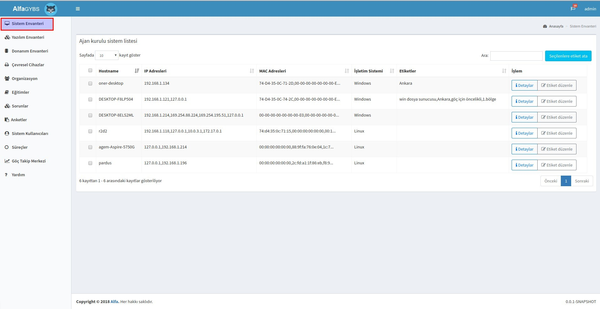

Ayrıca, listeden bir sistem kaydı seçilip **Detaylar** butonuna basılarak ajan detayları (üzerinde kurulu olan işletim sistemi, yazılımlar, kullanıcılar vb) görüntülenebilir.

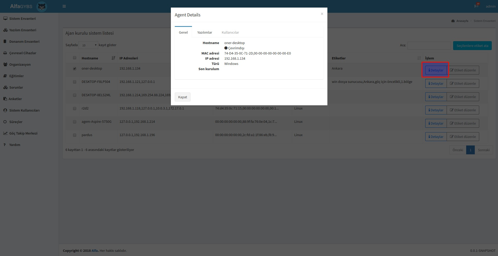

**Etiket düzenle** butonuna basılarak kayıtlı etiketlerden birden fazla seçim yapılabilir veya yeni etiket eklenebilir. Bu etiketler ileride bu sistemlerin gruplanması, bu etiketlere atanacak olası sorunların çözüm sürecinin izlenmesi ve dolayısı ile ilgili sistemin göçe hazır olup olmadığının belirlenmesine yardımcı olur.

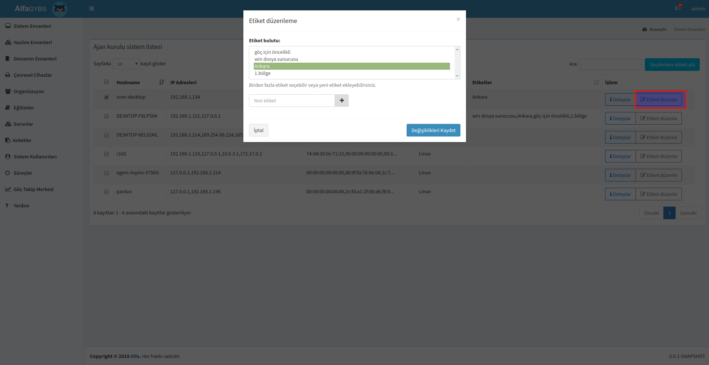

##NOT: YENİ ETİKET EKLEME ??

### Yazılım Envanteri

Yazılım envanteri; kuruma ait olan tüm yazılım envanterlerinin bulunduğu ekrandır. Bu yazılım envanteri sistemler üzerinde kurulu uygulamalarını (applications) ve sistem hizmetlerini (services) kapsar. Bu uygulama ve hizmetler Alfa ajanı tarafından GBYS'ne dahil olan sistemlerinden toparlanıp otomatik olarak kayıt altına alınabildikleri gibi ayrıca kullanıcı tarafından elle de eklenebilir. Yazımlara ait sorunlar ve göç'te bir sorun teşkil etmeyecek uyumlu yazılımlar yine bu arayüzden izlenebilir.

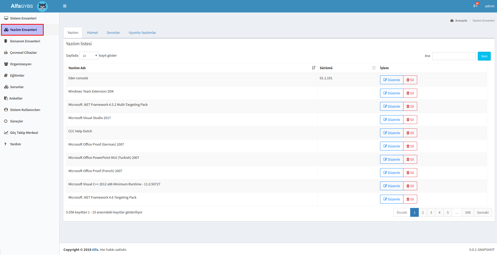

Yazılım listesinde; yukarıda belirtildiği gibi kuruma ait sistemlerde koşan uygulamaların adı ve sürüm bilgileri mevcuttur. **Yeni** butonuna basılarak yeni bir yazılım bilgisi girilebilir. Yazılım bilgisi **Düzenle** butonuna basılarak düzenlenebilir veya **Sil** butonuyla silinebilir. Düzenle işleminden; Yazılımın Adı, Sürümü, Ankette gösterilebilir ve Kurumsal yazılım seçenekleri düzenlenebilir.

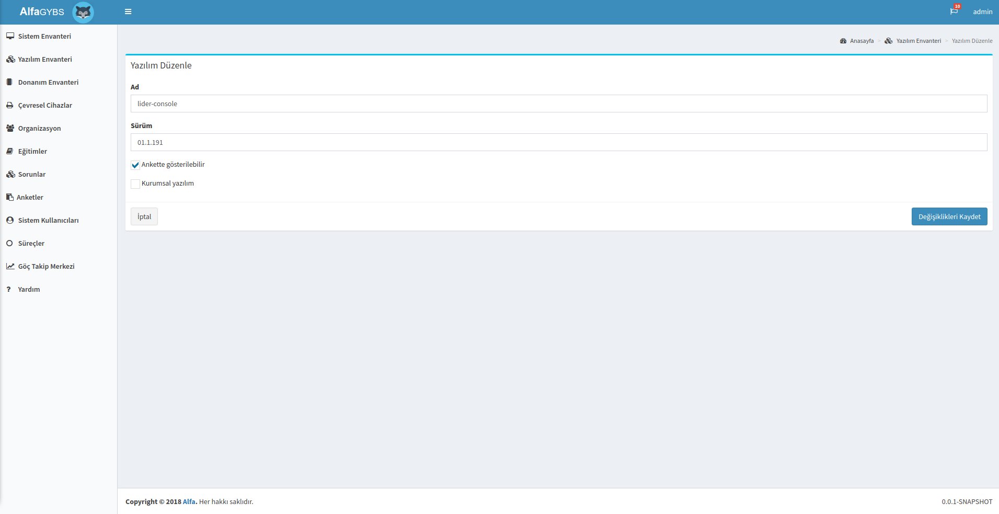

Hizmet listesinde; kurum sistemlerinde koşan hizmetlerin (services) listesi mevcuttur. **Yeni** butonuna basılarak yeni bir hizmet bilgisi girilebilir. **Düzenle** butonuna basılarak düzenlenebilir veya **Sil** butonuyla silinebilir. Düzenle işleminden; Hizmetin Adı düzenlenebilir.

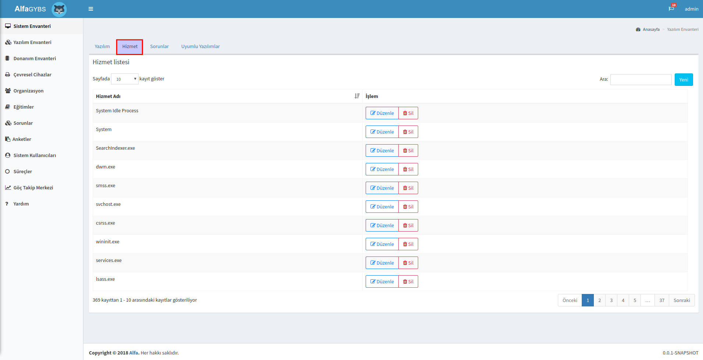

Sorunlar listesinde; yazılım kaynaklı sorunların listesi mevcuttur. **Yeni** butonuna basılarak yeni bir sorun bilgisi girilebilir. **Düzenle** butonuna basılarak düzenlenebilir veya **Sil** butonuyla silinebilir. **Süreç Başlat** butonuyla da, tanımlanan sorunu giderme amacıyla takip süreci başlatılır ve Süreçler ekranından takip edilebilir.

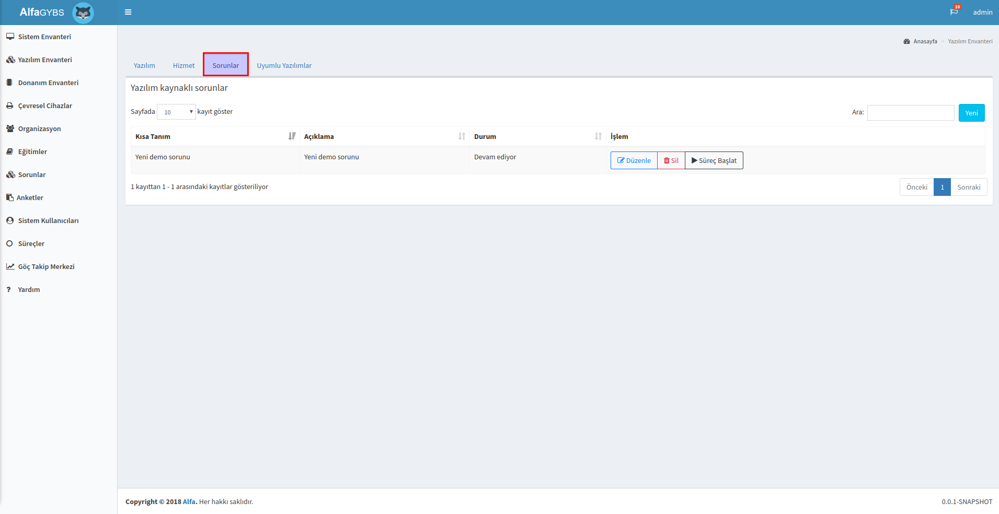

Yazılım sorunlarını düzenleme işleminde; soruna ait Tanım, Açıklama, Çalışma başlangıç tarihi, Tahmini bitiş tarihi, Varsa soruna ilişkin yazılım/donanım bilgisi, Sorunun çözülüp çözülmediğine dair seçenek ve Sorun çözülme tarihi bilgileri mevcuttur. Eğer tanımlanan süreç izin veriyor ise, süreç dahilinde bu tarihler otomatik olarak güncellenecektir. Bu tarihler aynı zamanda bu ekran aracılığı ile de elle güncellenebilir.

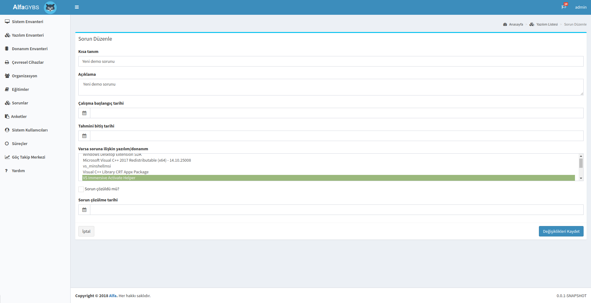

**Süreç Başlat** işleminde de soruna ait Sorumlu Rol, Açıklama, Tahmini Bitiş Tarihi ve Notlar bilgileri doldurulduktan sonra, **Başlat** butonuna basılarak süreç başlatılır. Bu arayüz, sisteme yüklenen ve başlatılacak süreç olarak  aktif süreçler arasından seçilen sürece ait bir başlangıç ekranıdır. Sistem dahilinde tasarlanan süreçlere ve süreç arayüzlerine göre bu ekran farklılık gösterecektir.

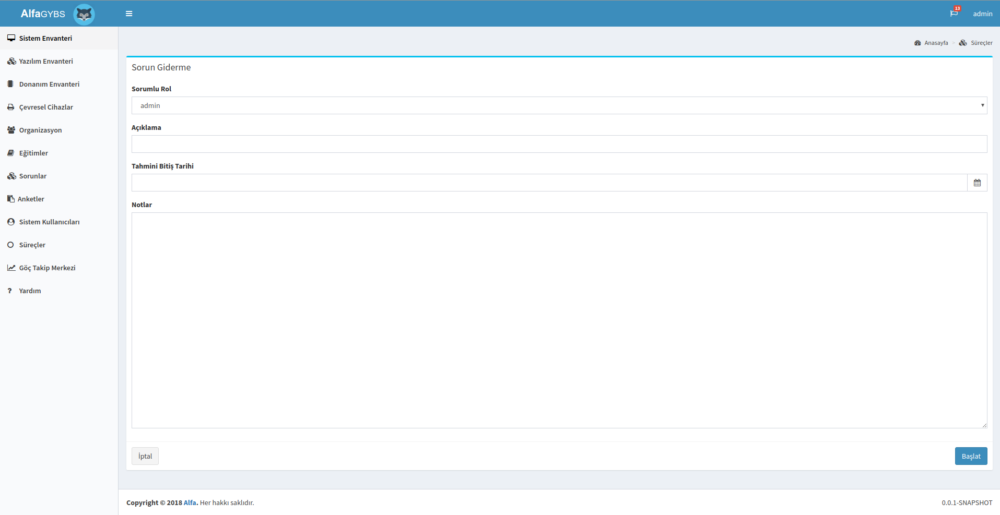

Uyumlu Yazılımlar listesinde; kuruma ait yazılımların, uyumlu olanları listelenir.

### Donanım Envanteri

Donanım envanteri; kuruma ait olan tüm donanım envanterlerinin bulunduğu ekrandır. İşlemci, Grafik kart, Disk, RAM Bellek, BIOS, Ağ ve Sorunlar listelerini içerir.

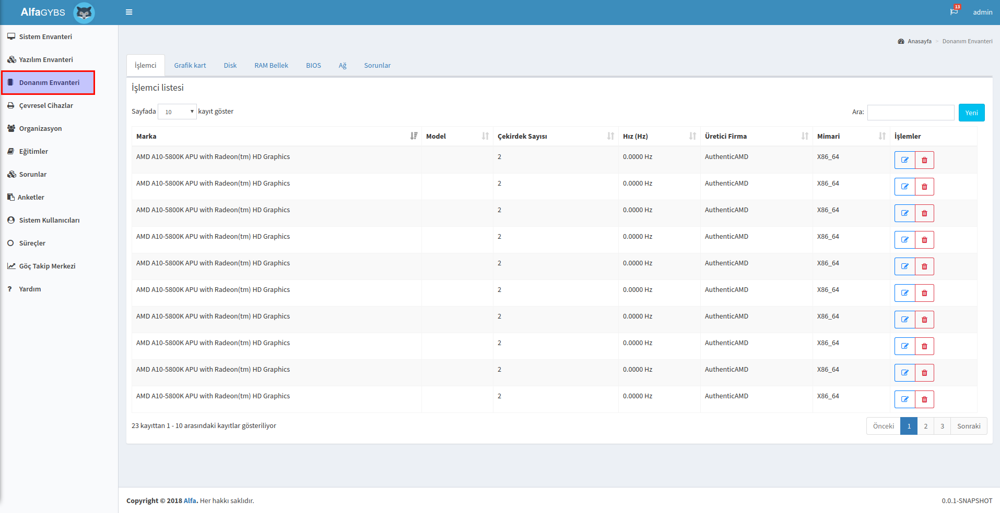

İşlemci listesinde; işlemciye ait Marka, Model, Çekirdek Sayısı, Hız, Üretici Firma ve Mimari bilgileri mevcuttur. **Yeni** butonuna basılarak yeni bir işlemci bilgisi girilebilir. İşlemci bilgisi **Düzenle** butonuna basılarak düzenlenebilir veya **Sil** butonuyla silinebilir. Düzenle işleminden; işlemciye ait çeşitli bilgiler düzenlenebilir.

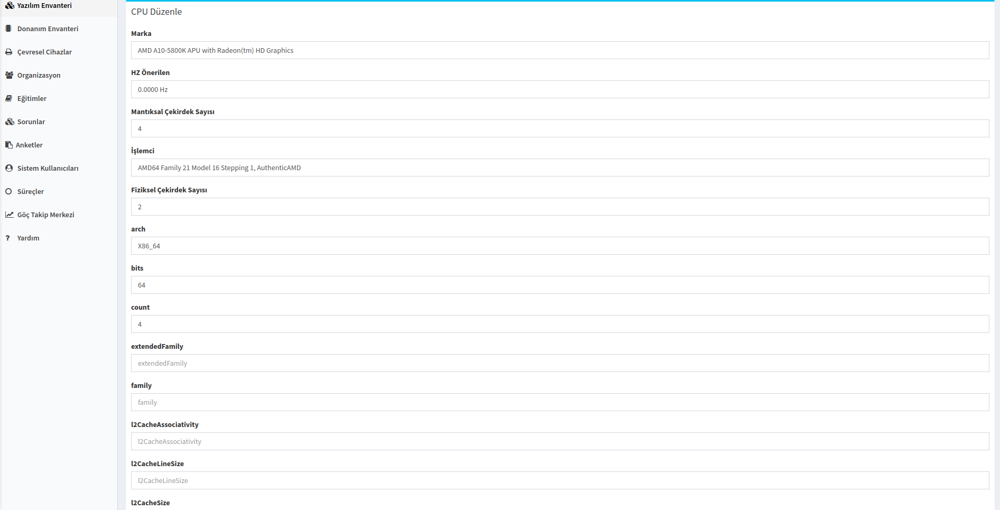

Grafik kart listesinde; ekran kartına ait Altsistem, Bellek, Kernel bilgileri mevcuttur.

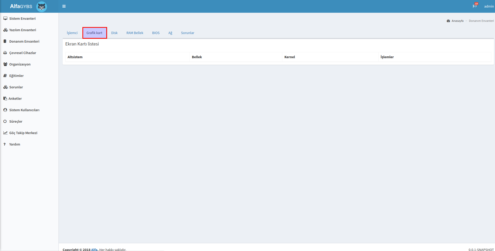

Disk listesinde; diske ait Marka, Açıklama, Versiyon, Ürün, Seri Numarası bilgileri mevcuttur. **Yeni** butonuna basılarak yeni bir disk bilgisi girilebilir. Disk bilgisi **Düzenle** butonuna basılarak düzenlenebilir veya **Sil** butonuyla silinebilir. Düzenle işleminden; Sağlayıcı, Açıklama, Versiyon, Ürün ve Ajan bilgileri düzenlenebilir.

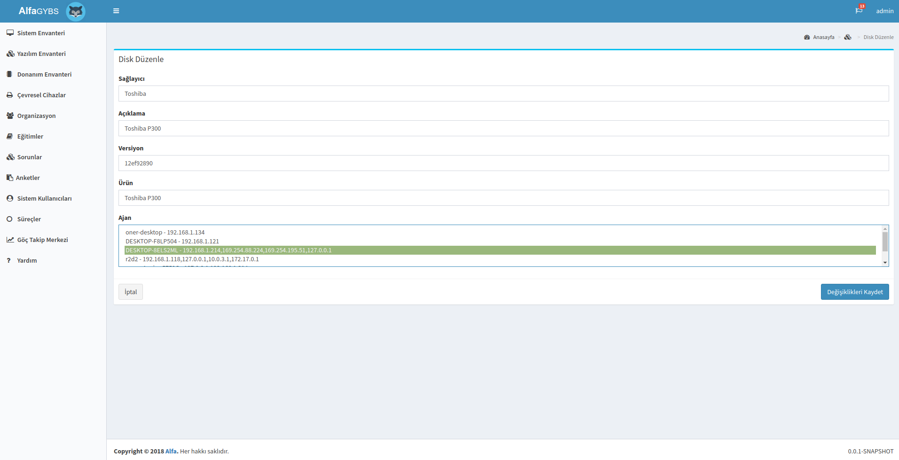

Bellek listesinde; belleğe ait Marka, Hız, Boyut, Tip bilgileri mevcuttur. **Yeni** butonuna basılarak yeni bir bellek bilgisi girilebilir. Bellek bilgisi **Düzenle** butonuna basılarak düzenlenebilir veya **Sil** butonuyla silinebilir. Düzenle işleminden; Sağlayıcı, Açıklama, Versiyon, Ürün ve Ajan bilgileri düzenlenebilir.

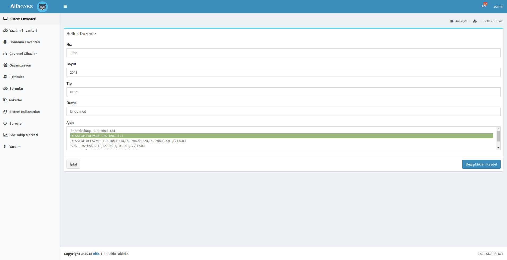

BIOS listesinde; BIOS'a ait Marka, Versiyon ve Çıkış Tarihi bilgileri mevcuttur. **Yeni** butonuna basılarak yeni bir BIOS bilgisi girilebilir.

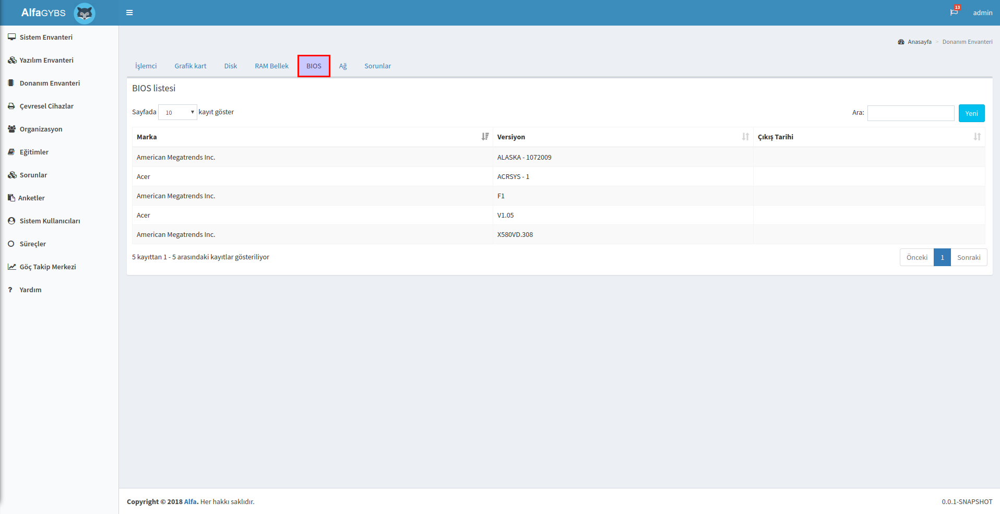

Ağ listesinde; ağa ait Marka, Versiyon, Ürün ve Yetenekler bilgileri mevcuttur. **Yeni** butonuna basılarak yeni bir ağ bilgisi girilebilir. Ağ bilgisi **Düzenle** butonuna basılarak düzenlenebilir veya **Sil** butonuyla silinebilir. Düzenle işleminden; Sağlayıcı, Versiyon, Ürün, Yetenekler ve Ajan bilgileri düzenlenebilir.

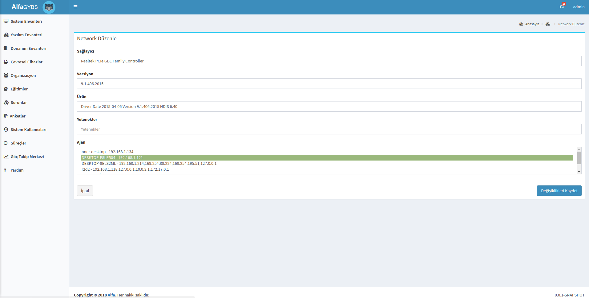

Sorunlar listesinde; donanım kaynaklı sorunların listesi mevcuttur. **Yeni** butonuna basılarak yeni bir sorun bilgisi girilebilir. **Düzenle** butonuna basılarak düzenlenebilir veya **Sil** butonuyla silinebilir. **Süreç Başlat** butonuyla da, tanımlanan sorunu giderme amacıyla takip süreci başlatılır ve Süreçler ekranından takip edilebilir.

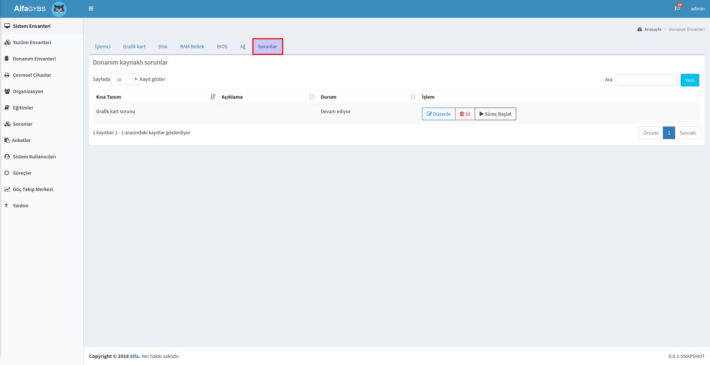

Donanım sorunlarını düzenleme işleminde; soruna ait Tanım, Açıklama, Çalışma başlangıç tarihi, Tahmini bitiş tarihi, Varsa soruna ilişkin yazılım/donanım bilgisi, Sorunun çözülüp çözülmediğine dair seçenek ve Sorun çözülme tarihi bilgileri mevcuttur.

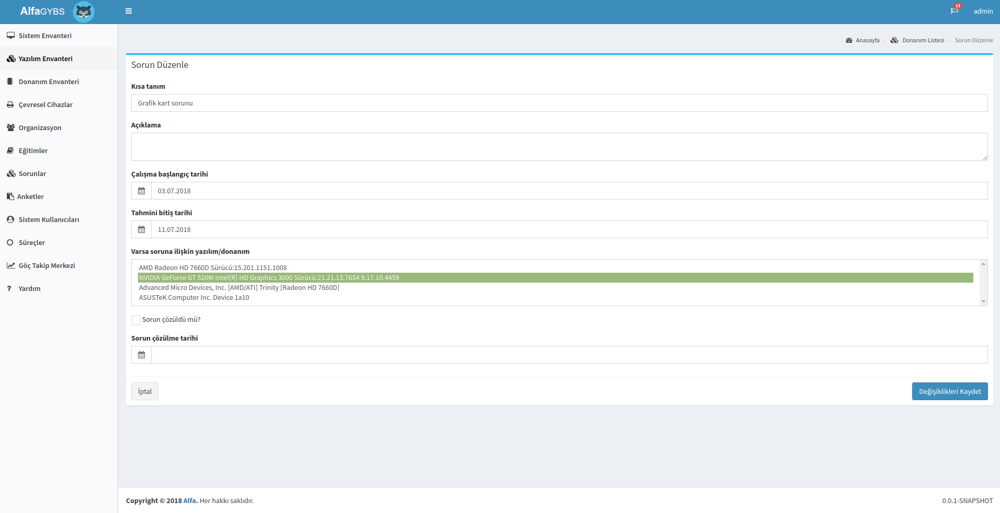

**Süreç Başlat** işleminde de soruna ait Sorumlu Rol, Açıklama, Tahmini Bitiş Tarihi ve Notlar bilgileri doldurulduktan sonra, **Başlat** butonuna basılarak süreç başlatılır.

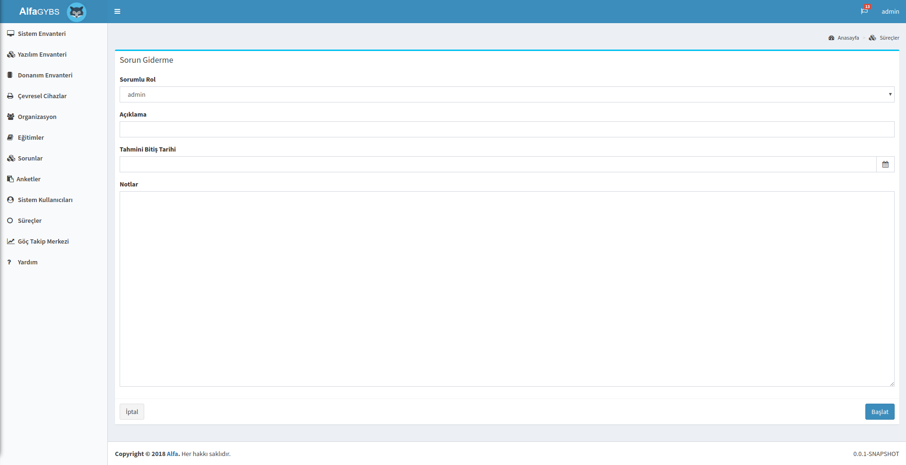

### Çevresel Cihazlar

Çevresel cihazlar listesi; bilgisayarın dışından bilgi almak için kullanılan yardımcı cihazların listesidir.

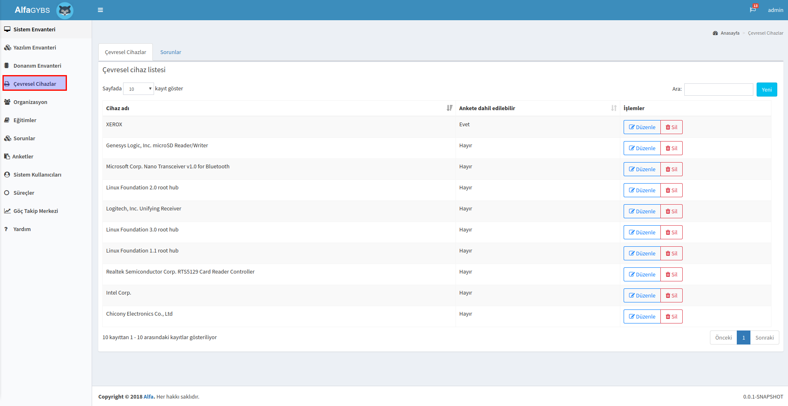

 **Yeni** butonuna basılarak yeni bir cihaz bilgisi girilebilir. Cihaz bilgisi **Düzenle** butonuna basılarak düzenlenebilir veya **Sil** butonuyla silinebilir. Düzenle işleminden; Sağlayıcı, Cihazın Adı, Sistemde gözüken cihaz ID, Cihaz dizini, Varsa ilişkili dizini ve Ankette gösterilebilir bilgileri düzenlenebilir.

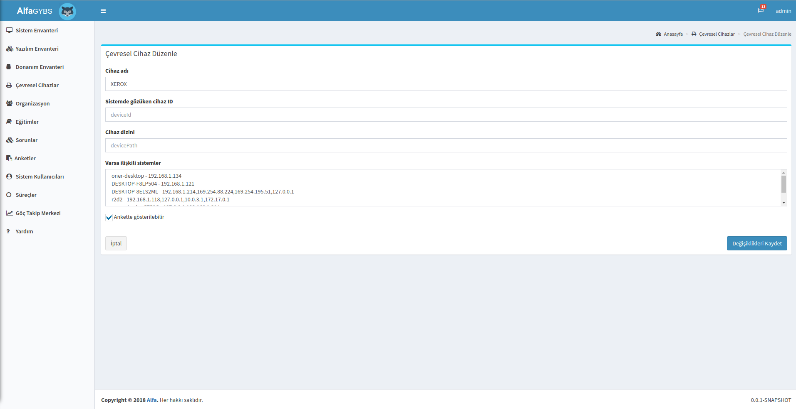

Sorunlar listesinde; çevresel cihazlar kaynaklı sorunların listesi mevcuttur. **Yeni** butonuna basılarak yeni bir sorun bilgisi girilebilir. **Düzenle** butonuna basılarak düzenlenebilir veya **Sil** butonuyla silinebilir. **Süreç Başlat** butonuyla da, tanımlanan sorunu giderme amacıyla takip süreci başlatılır ve Süreçler ekranından takip edilebilir.

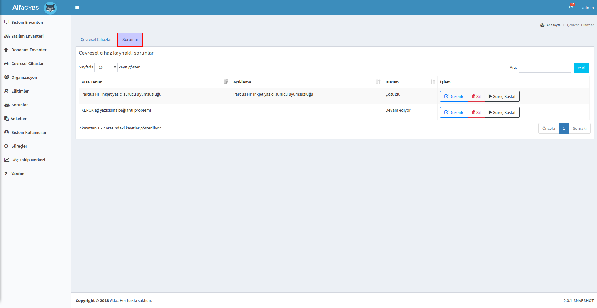

Çevresel cihazlara ait sorunlarını düzenleme işleminde; soruna ait Tanım, Açıklama, Çalışma başlangıç tarihi, Tahmini bitiş tarihi, Varsa soruna ilişkin yazılım/donanım bilgisi, Sorunun çözülüp çözülmediğine dair seçenek ve Sorun çözülme tarihi bilgileri mevcuttur.

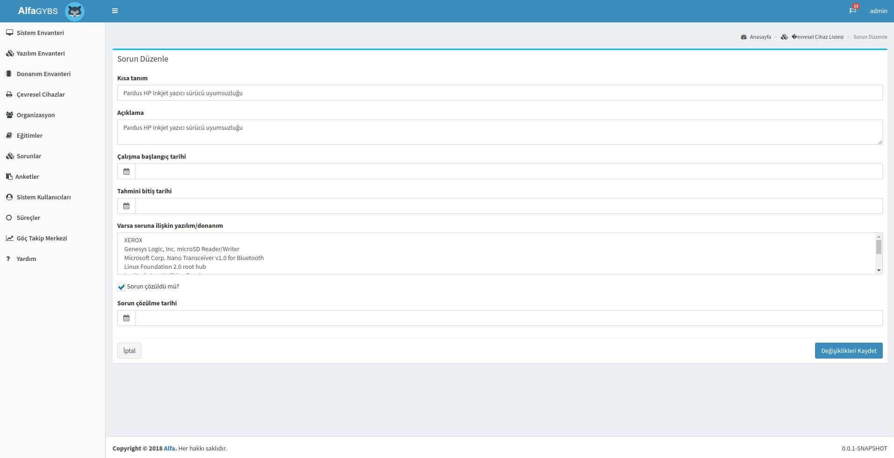

**Süreç Başlat** işleminde de soruna ait Sorumlu Rol, Açıklama, Tahmini Bitiş Tarihi ve Notlar bilgileri doldurulduktan sonra, **Başlat** butonuna basılarak süreç başlatılır.

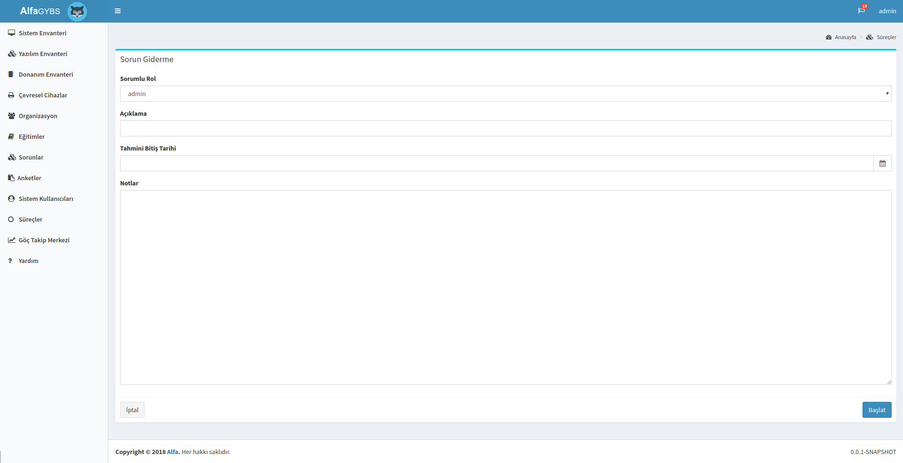

### Organizasyon

Kurumdaki mevcut LDAP sunucularına bağlanıp kullanıcıları ALFA'nın kendi veritabanına çekmesini sağlar. Oluşan listede; Sunucu Adres, Tür, UID Özniteliği, Oluşturma Tarihi bilgileri mevcuttur.

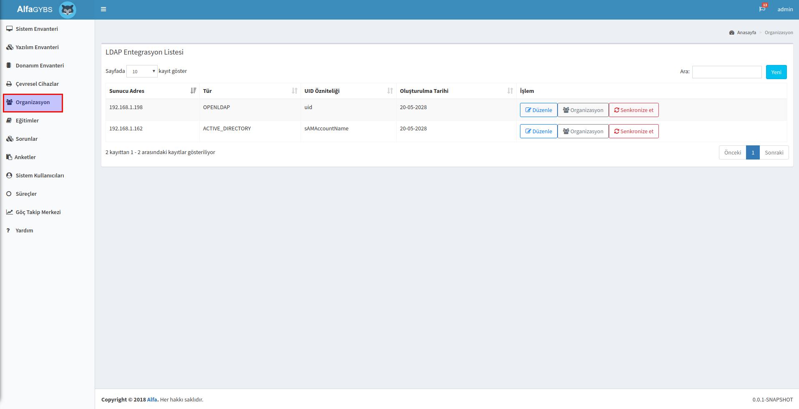

**Yeni** butonuna basılarak yeni bir LDAP Entegrasyon bilgisi girilebilir. **Düzenle** butonuna basılarak düzenlenebilir.

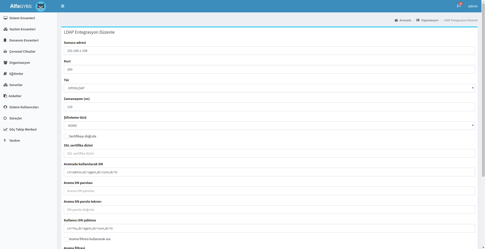

**Organizasyon** butonuna basılarak kurumun LDAP'ından çekilen kullanıcı bilgileri görüntülenir.

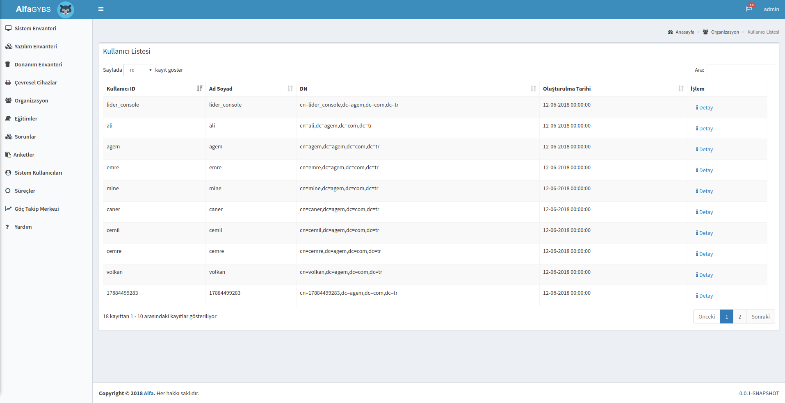

**Senkronize et** butonuna basılarak mevcut sunucu bilgilerini kullanarak entegre olunan LDAP'taki kullanıcıları senkronize eder.

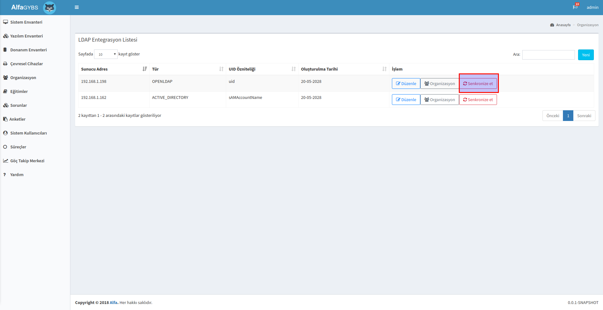

### Eğitimler

Kuruma ait eğitim bilgilerinin listelendiği ekrandır. Eğitime ait Tanım ve Açıklama bilgileri listelenir. **Yeni** butonuna basılarak yeni bir eğitim bilgisi girilebilir. **Düzenle** butonuna basılarak düzenlenebilir. **Paylaş** butonuyla eğitimin paylaşılacağı ajanlar seçilebilir. **Sil** butonuyla silinebilir.

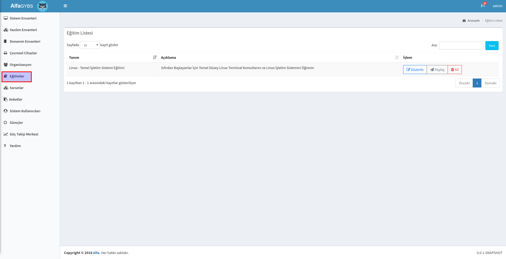

### Sorunlar

Yazılım ve Donanım Envanteri ve Çevresel Cihazlara ait sorunların listendiği ekrandır. Soruna ait Tanım, Durum, Başlangıç Tarihi, Tahmini Bitiş Tarihi, Çözüldüğü Tarih, İlişkili olduğu çevresel birimler, İlişkili olduğu donanımlar ve İlişkili olduğu yazılımların bilgisi mevcuttur. **Düzenle** butonuna basılarak sorun düzenlenebilir. **Süreç Başlat** butonuyla da, tanımlanan sorunu giderme amacıyla takip süreci başlatılır ve Süreçler ekranından takip edilebilir.

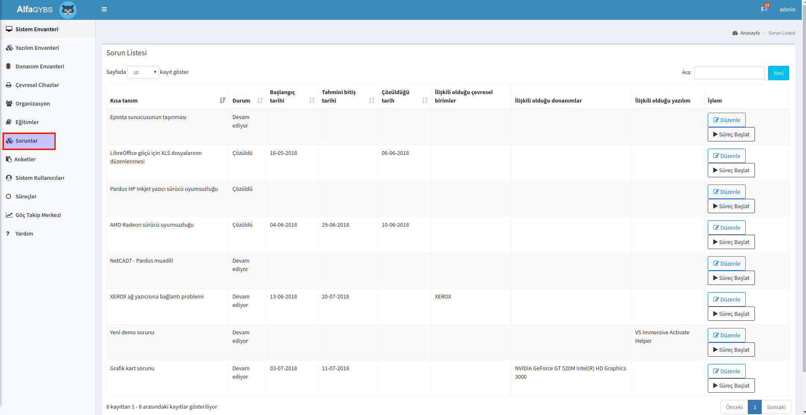

### Anketler

Anket Listesi; yazılım, donanım ve çevresel cihazların kullanımına dair yapılan anketlerin listesini içerir. **Yeni** butonuna basılarak yeni bir anket bilgisi girilebilir. **Düzenle** butonuna basılarak anket düzenlenebilir. **Gönder** butonuyla anketin gönderileceği ajanlar seçilebilir. **Sonuçlar** butonuyla anketin sonucunun gösterileceği ajan seçilebilir. **Sil** butonuyla anket silinebilir.

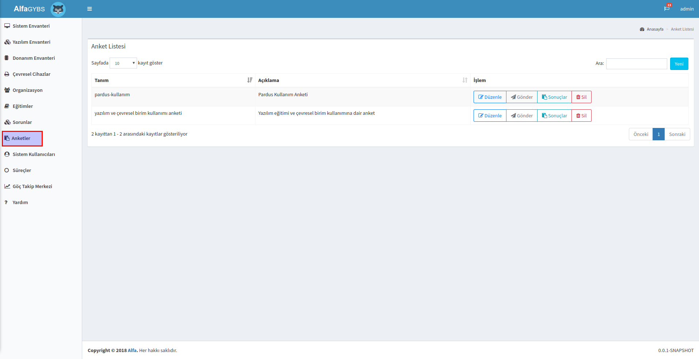

Anket düzenleme ekranından anketin Tanım ve Açıklama bilgilerinin düzenebileceği gibi anketin tasarımına dair de çeşitli ayarlar mevcuttur.

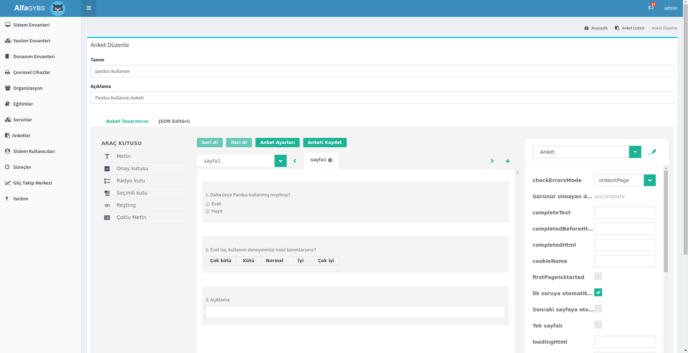

### Sistem Kullanıcıları

ALFA sistemini kullanan kullanıcıların listesini gösteren ekrandır. Kullanıcıya ait; Kullanıcı Adı, İsim, Soyisim, E-posta ve Rol bilgilerini içerir. **Yeni** butonuna basılarak yeni bir kullanıcı bilgisi girilebilir. **Düzenle** butonuna basılarak kullanıcı bilgileri düzenlenebilir.

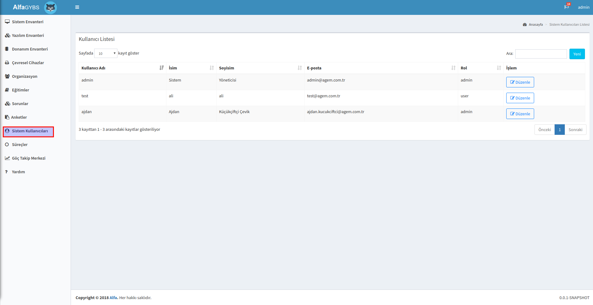

### Süreçler

Tanımlanan sorunu giderme amacıyla başlatılan takip süreçlerinin bulunduğu listedir. Sürecin Adı ve Sürecin Sürümü bilgileri mavcuttur.**Yeni** butonuna basılarak yeni bir süreç bilgisi girilebilir. **Düzenle** butonuna basılarak süreç düzenlenebilir. **Sil** butonuyla süreç silinebilir. **Start** butonuyla sorunun giderilmesine ilişkin süreç başlatılır.

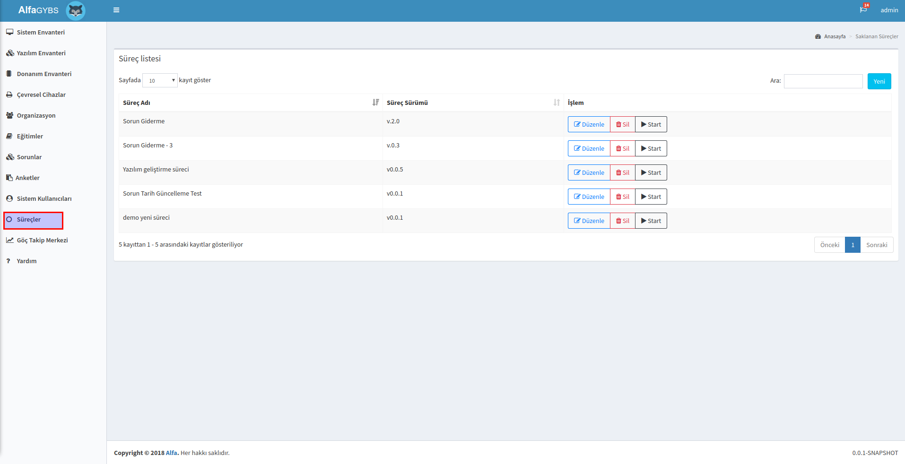

### Göç Takip Merkezi

Pardus göçünün sayısal ve grafiksel verilerle takip edildiği ekranlardır. Göçe dair Mevcut Durum, Göç Durumu, Sorun İzleme ve Göç Planlama ekranları bulunur.

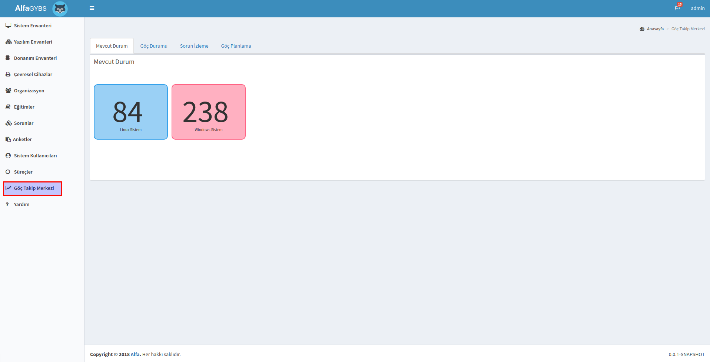

Göç Durumu ekranında; Aylık Başarılı Göç Yapılan Sistemler (Kümülatif) ve Aylık Başarılı Göç Yapılan Sistemler grafikleri mevcuttur.

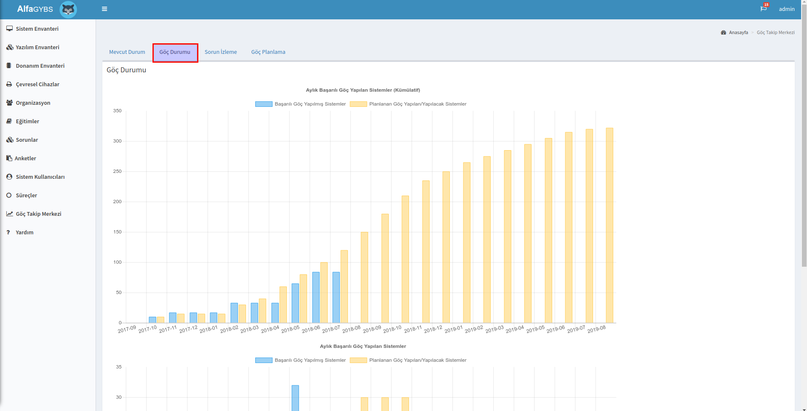

Sorun İzleme ekranında; Aylık Göç Problemleri Durumuna ait bir grafik bulunur. Grafikte; Devam Eden Problemler, Yeni Problemler ve Çözülen Problemler görüntülenir.

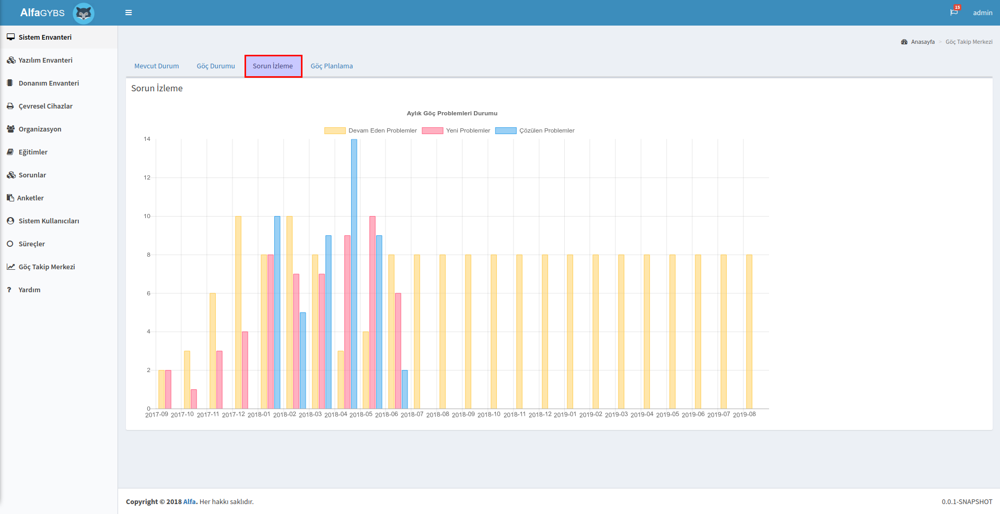

Göç Planlama ekranında; göç için yapılan planların listesi mevcuttur. Planlanan göçlere **Süreç Başlat** butonuna basılarak takip süreci başlatılır.

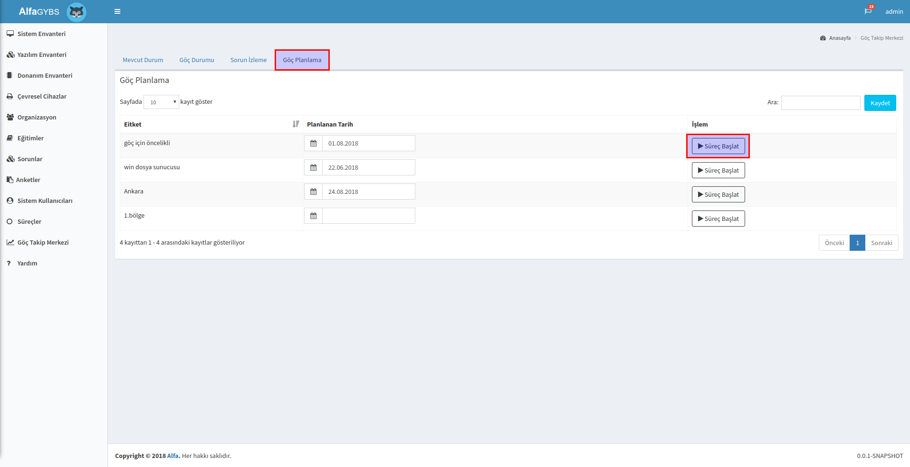

### Yardım

TODO

[geri](./)